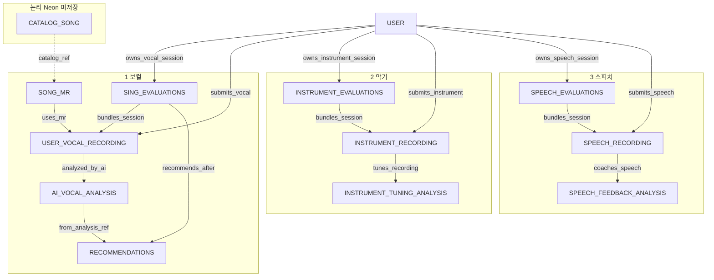
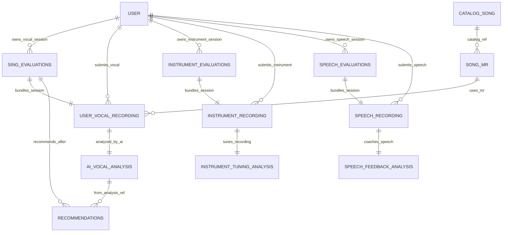
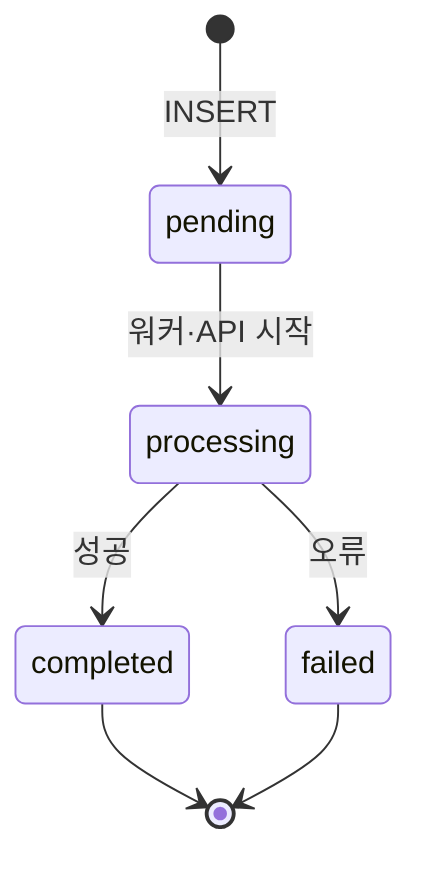

# Music ERD (보컬 · 악기 · 스피치)

IUEM **음악·말하기** 도메인 ERD. 구현: `woojeongai/apps/music` (SQLModel → Neon PostgreSQL).  
프론트: `/analyze`(보컬), `/instrument`(악기 튜닝), `/speech`(스피치) → Next `app/api/*` 프록시 → FastAPI.

| 도메인 | 화면 | 저장 API |
|--------|------|----------|
| 보컬 | `/analyze` | `POST /api/music/sing-evaluation` |
| 악기 | `/instrument` | `POST /api/music/instrument-evaluation` |
| 스피치 | `/speech` | `POST /api/music/speech-evaluation` |

영상 업로드 분석(`POST /api/music/analyze-video`)은 **DB 테이블 없이** 응답만 반환하며, 저장 시 **보컬** 경로로 합류한다.

**상위 문서:** [BACKEND_RULES.md](./BACKEND_RULES.md) · [ENTITY_RULE.md](./ENTITY_RULE.md) · [TITANIC_ERD.md](./TITANIC_ERD.md)

| ERD 엔티티 | Neon 테이블 (구현) |
|------------|-------------------|
| `CATALOG_SONG` | 없음 (`catalog.py` 인메모리) |
| `SONG_MR` | `song_mr_search_lists` |
| `INSTRUMENT_CATALOG` | 없음 (`instrument_catalog.py` 인메모리) |
| `SPEECH_TOPIC` | 없음 (`speech_catalog.py` 인메모리) |
| `USER` | `users` (`friday13th`) |
| `SING_EVALUATIONS` | `sing_evaluations` |
| `USER_VOCAL_RECORDING` | `user_vocal_recordings` |
| `AI_VOCAL_ANALYSIS` | `ai_vocal_analyses` |
| `RECOMMENDATIONS` | `vocal_recommendations` |
| `INSTRUMENT_EVALUATIONS` | `instrument_evaluations` |
| `INSTRUMENT_RECORDING` | `instrument_recordings` |
| `INSTRUMENT_TUNING_ANALYSIS` | `instrument_tuning_analyses` |
| `SPEECH_EVALUATIONS` | `speech_evaluations` |
| `SPEECH_RECORDING` | `speech_recordings` |
| `SPEECH_FEEDBACK_ANALYSIS` | `speech_feedback_analyses` |

---

## 스키마 정본 (v2 · 3NF · 비동기 · 감사 타임스탬프)

| 항목 | v2 조치 |
|------|---------|
| **3NF — `USER_VOCAL_RECORDING` 중복 FK** | `catalog_song_id` **제거**. 곡 맥락은 **`mr_search_list_id` → `SONG_MR.catalog_song_id`** 로만 조회 (이행 종속 제거). |
| **`status` (비동기)** | 세션·녹음·분석·추천 파이프라인 테이블에 `pending` → `processing` → `completed` \| `failed` |
| **`created_at` / `updated_at`** | Neon 저장 **모든 테이블**에 감사용 타임스탬프 보완. `recorded_at`·`analyzed_at`은 도메인 이벤트 시각으로 **유지**(선택). |

**`status` 적용 테이블:** `sing_evaluations`, `user_vocal_recordings`, `ai_vocal_analyses`, `vocal_recommendations`, `instrument_evaluations`, `instrument_recordings`, `instrument_tuning_analyses`, `speech_evaluations`, `speech_recordings`, `speech_feedback_analyses`

**카탈로그 곡 조회 (녹음 행):**

```sql
SELECT r.*, mr.catalog_song_id, mr.title, mr.artist
FROM user_vocal_recordings r
LEFT JOIN song_mr_search_lists mr ON mr.id = r.mr_search_list_id;
```

---

## 서비스 흐름 (정본)

1. 사용자가 서버 **카탈로그 곡**을 검색·선택한다 (`CATALOG_SONG` → `SONG_MR` 행 생성).
2. 그 **MR 맥락**으로 **마이크 녹음** 또는 **영상·음원 업로드** → `USER_VOCAL_RECORDING`에 **`mr_search_list_id`만** 저장 (`status`: `pending` → 업로드·저장 후 `processing`).
3. **AI**가 **사용자(USER)가 아니라** 그 **녹음(`USER_VOCAL_RECORDING`)** 을 분석 → `AI_VOCAL_ANALYSIS` (`analyzed_by_ai`, `status`: `processing` → `completed`).
4. 같은 시도를 **추천·조회용으로 묶는 세션** → `SING_EVALUATIONS` (**허브**, `user_id` + `status` + 타임스탬프).
5. **추천 장르·곡·발성 패턴** → `RECOMMENDATIONS` (**`ai_vocal_analyses.id` FK**로 점수 정본 참조, 중복 컬럼 없음).

**평가 대상:** `USER` ❌ → 각 **RECORDING** 행 ✅ (보컬·악기·스피치 공통).

### 악기 튜닝

1. `GET /api/music/instrument-catalog` — `INSTRUMENT_CATALOG`(기타·피아노).
2. 마이크 연주 녹음 → 클라이언트 데모 튜닝 점수.
3. `POST /api/music/instrument-evaluation` → `INSTRUMENT_EVALUATIONS` → `INSTRUMENT_RECORDING` → `INSTRUMENT_TUNING_ANALYSIS`.

### 스피치 코칭

1. `GET /api/music/speech-topics` — `SPEECH_TOPIC` 목록.
2. 주제 선택 후 마이크 녹음 → 클라이언트 데모 피드백.
3. `POST /api/music/speech-evaluation` → `SPEECH_EVALUATIONS` → `SPEECH_RECORDING` → `SPEECH_FEEDBACK_ANALYSIS`.

---

## 식별 관계 vs 비식별 관계

| 구분 | 정의 | 본 ERD |
|------|------|--------|
| **식별 관계 (Identifying)** | 자식이 부모 없이 존재할 수 없고, **부모 FK가 자식 PK의 일부**인 경우 (약한 엔티티) | **없음** — 모든 테이블 PK는 대리키 `id` 단독 |
| **비식별 관계 (Non-identifying)** | 자식이 **자체 PK `id`** 를 갖고, 부모 FK는 **일반 컬럼** (N:1) | **모든 FK 관계** |

**부모·자식 판단 (N:1):** FK를 가진 테이블이 **자식**, 참조 대상이 **부모**. 예: `instrument_recordings.instrument_evaluation_id` → 부모 `instrument_evaluations`.

**구현 1:1:** 자식 FK에 **UNIQUE** (`sing_evaluation_id`, `instrument_evaluation_id`, `speech_evaluation_id`, `user_vocal_recording_id` 등) — 논리적으로 1:1, ERD 표기는 N:1 허용.

---

## ER 다이어그램 (통합 정본 · v2)

**배치:** `layoutDirection: TB`(위→아래). `USER` 중심 **[1] 보컬 · [2] 악기 · [3] 스피치**. 관계 라벨 **(점선)** = **비식별 N:1**.

| 관계 (N:1 · 비식별) | 라벨 |
|---------------------|------|
| `USER` → `SING_EVALUATIONS` | owns_vocal_session |
| `USER` → `USER_VOCAL_RECORDING` | submits_vocal |
| `CATALOG_SONG` → `SONG_MR` | catalog_ref (논리) |
| `SONG_MR` → `USER_VOCAL_RECORDING` | uses_mr |
| `SING_EVALUATIONS` → `USER_VOCAL_RECORDING` | bundles_session |
| `USER_VOCAL_RECORDING` → `AI_VOCAL_ANALYSIS` | analyzed_by_ai |
| `SING_EVALUATIONS` / `AI_VOCAL_ANALYSIS` → `RECOMMENDATIONS` | recommends_after / from_analysis_ref |
| `USER` → `INSTRUMENT_EVALUATIONS` | owns_instrument_session |
| `USER` → `INSTRUMENT_RECORDING` | submits_instrument |
| `INSTRUMENT_EVALUATIONS` → `INSTRUMENT_RECORDING` | bundles_instrument_session |
| `INSTRUMENT_RECORDING` → `INSTRUMENT_TUNING_ANALYSIS` | tunes_recording |
| `USER` → `SPEECH_EVALUATIONS` | owns_speech_session |
| `USER` → `SPEECH_RECORDING` | submits_speech |
| `SPEECH_EVALUATIONS` → `SPEECH_RECORDING` | bundles_speech_session |
| `SPEECH_RECORDING` → `SPEECH_FEEDBACK_ANALYSIS` | coaches_speech |

논리 전용(다이어그램 밖): `CATALOG_SONG`, `INSTRUMENT_CATALOG` → `instrument_id`, `SPEECH_TOPIC` → `topic_id`.

### 시각 ERD (참조 레이아웃 · v2)

참조 이미지와 동일하게 **USER 중앙 · 보컬 · 악기 · 스피치** 3갈래. v2: `USER_VOCAL_RECORDING`에 **`catalog_song_id` 없음**, 파이프라인 전체 **`status`** + **`created_at`/`updated_at`**.



> v1 참조 이미지와 차이: `CATALOG_SONG` → `USER_VOCAL_RECORDING` 직접 FK **삭제**. 곡은 `SONG_MR` 경유.

---

### dbdiagram.io (DBML)

[dbdiagram.io](https://dbdiagram.io) → **Import** → [`music_erd_v2.dbml`](./music_erd_v2.dbml) 파일을 연다.

- `CATALOG_SONG` 포함 (논리 테이블)
- `user_vocal_recordings`에 **`catalog_song_id` 없음** (3NF)
- 파이프라인 테이블 전부 **`status`** + **`created_at`/`updated_at`**

### Mermaid `erDiagram` (관계만)

컬럼 상세는 [`music_erd_v2.dbml`](./music_erd_v2.dbml) 참고. Mermaid attribute 블록은 **따옴표·한글·파이프** 때문에 깨지므로 **관계선만** 유지한다.



### 엔티티 컬럼 요약 (v2)

| 엔티티 | PK | 주요 FK | status | created_at / updated_at |
|--------|-----|---------|--------|-------------------------|
| USER | id | — | — | O / O |
| CATALOG_SONG | catalog_song_id | — (논리) | — | — |
| SONG_MR | id | catalog_song_id (논리) | — | O / O |
| SING_EVALUATIONS | id | user_id | O | O / O |
| USER_VOCAL_RECORDING | id | user_id, **mr_search_list_id**, sing_evaluation_id | O | O / O |
| AI_VOCAL_ANALYSIS | id | user_vocal_recording_id | O | O / O |
| RECOMMENDATIONS | id | sing_evaluation_id, ai_vocal_analysis_id | O | O / O |
| INSTRUMENT_EVALUATIONS | id | user_id | O | O / O |
| INSTRUMENT_RECORDING | id | user_id, instrument_evaluation_id | O | O / O |
| INSTRUMENT_TUNING_ANALYSIS | id | instrument_recording_id | O | O / O |
| SPEECH_EVALUATIONS | id | user_id | O | O / O |
| SPEECH_RECORDING | id | user_id, speech_evaluation_id | O | O / O |
| SPEECH_FEEDBACK_ANALYSIS | id | speech_recording_id | O | O / O |

```text
USER --owns--> SING_EVALUATIONS --1:1--> USER_VOCAL_RECORDING --1:1--> AI_VOCAL_ANALYSIS
CATALOG_SONG --catalog--> SONG_MR --uses_mr--> USER_VOCAL_RECORDING
RECOMMENDATIONS --> SING_EVALUATIONS , AI_VOCAL_ANALYSIS
USER --owns--> INSTRUMENT_EVALUATIONS --1:1--> INSTRUMENT_RECORDING --1:1--> INSTRUMENT_TUNING_ANALYSIS
USER --owns--> SPEECH_EVALUATIONS --1:1--> SPEECH_RECORDING --1:1--> SPEECH_FEEDBACK_ANALYSIS
```

## 관계 (요약)

보컬·악기·스피치 공통: **USER → 평가 세션 → RECORDING → ANALYSIS** (전부 **비식별 N:1**, RECORDING·ANALYSIS 쪽 FK **UNIQUE**로 1:1 운영).

| 도메인 | 세션 → 녹음 → 분석 |
|--------|-------------------|
| 보컬 | `SING_EVALUATIONS` → `USER_VOCAL_RECORDING` → `AI_VOCAL_ANALYSIS` |
| 악기 | `INSTRUMENT_EVALUATIONS` → `INSTRUMENT_RECORDING` → `INSTRUMENT_TUNING_ANALYSIS` |
| 스피치 | `SPEECH_EVALUATIONS` → `SPEECH_RECORDING` → `SPEECH_FEEDBACK_ANALYSIS` |

보컬만 `RECOMMENDATIONS`·`SONG_MR`·`CATALOG_SONG` 연동.

**저장 순서 (각 POST):** 세션 INSERT → 녹음(`*_evaluation_id` FK) → 분석(`*_recording_id` FK).

---

## 정규화 점검 (NF)

관계형 **1NF ~ BCNF** 기준으로 위 ER·Neon을 점검한 요약이다.

**결론:** **단일 PK `id`** → **2NF 충족**. v2에서 **`user_vocal_recordings.catalog_song_id` 제거** → 곡 맥락은 **`mr_search_list_id` → `song_mr_search_lists.catalog_song_id`** 단일 경로로 **3NF 충족**. `vocal_recommendations`는 **`ai_vocal_analyses` FK** 만으로 점수 정본 참조. `SONG_MR` 검색 스냅샷·추천 **JSON**은 **의도적 denorm**으로 문서화 유지.

### 요약 표

| 엔티티 (테이블) | 1NF | 2NF | 3NF | 비고 |
|-----------------|-----|-----|-----|------|
| `USER` (`users`) | ✅ | ✅ | ✅ | 단일 PK, 원자값 |
| `CATALOG_SONG` | ✅ | — | — | DB 미저장(논리만) |
| `SONG_MR` (`song_mr_search_lists`) | ✅ | ✅ | ⚠️ | 카탈로그 스냅샷 검색 로그 (**의도적 denorm**) |
| `SING_EVALUATIONS` (`sing_evaluations`) | ✅ | ✅ | ✅ | 허브 · `status` + `created_at`/`updated_at` |
| `USER_VOCAL_RECORDING` (`user_vocal_recordings`) | ✅ | ✅ | ✅ | **`mr_search_list_id`만 FK** · `catalog_song_id` 제거 (v2) |
| `AI_VOCAL_ANALYSIS` (`ai_vocal_analyses`) | ✅ | ✅ | ✅ | 점수·요약 정본 · `status` + 타임스탬프 |
| `RECOMMENDATIONS` (`vocal_recommendations`) | ⚠️² | ✅ | ✅³ | **AI FK 참조**. JSON 장르·곡 · `status` + `updated_at` |

² 장르·곡 JSON — 실무상 1셀=JSON 허용. **4NF**로 풀려면 자식 테이블.

³ API 필드 이름 `pitchScoreSnapshot` 등은 **DB 저장 없이 조인 결과**로 채운다.

**v2 3NF 조치 (`USER_VOCAL_RECORDING`):**

| 제거 | 유지 | 이유 |
|------|------|------|
| `catalog_song_id` | `mr_search_list_id` | `catalog_song_id` → `SONG_MR.catalog_song_id` 이행 종속. MR 행이 곡 맥락 **정본**. |

### 다 대 다(M:N) 점검·조치

| 후보 관계 | 판단 | 조치 |
|------------|------|------|
| USER × MR 전개 | 순수 **M:N** 이 아니라 **USER→녹음→MR** 두 단계 **1:N** | 교차테이블 불필요 |
| SESSION × ANALYSIS | 분석 행은 **녹음 1:1**로만 존재, 세션과 **직접 M:N 테이블 없음** | 유지 |
| SESSION × RECORDING | FK **`user_vocal_recordings.sing_evaluation_id`** 로 **세션별 녹음 1:1**(UNIQUE) | 유지 |

### 1NF

- 스칼라 원자값. JSON 배열은 “한 셀 한 JSON 값” 허용(위 표 ²).

### 2NF

- [ENTITY_RULE.md](./ENTITY_RULE.md) — PK `id` 단일라 부분 종속 없음.

### 3NF (이행 종속)

| 패턴 | 상태 |
|------|------|
| `SONG_MR` 곡 메타 | 허용 **스냅샷 검색 행**. |
| `sing_evaluations` 점수·카탈로그·입력 미러 | **컬럼 제거**(ORM)·Neon DDL [`normalize_music_3nf.sql`](../migrations/normalize_music_3nf.sql) |
| 추천의 점수 스냅샷 숫자 3컬럼 | **제거**, `ai_vocal_analysis_id` FK로 대체 |
| `USER_VOCAL_RECORDING` `catalog_song_id` | **v2 제거** — MR FK만 |

### BCNF · 4NF

- `SONG_MR` 행렬 — BCNF 밖 허용(스냅샷). 장르 JSON — 필요 시 장르 행 분해.

### 구현 갭 정리

| 항목 | 권장 |
|------|------|
| Neon 레거시 스키마 | `normalize_music_3nf.sql` + v2 DDL (`catalog_song_id` DROP, `status`/`updated_at` ADD) |
| `user_vocal_recordings.catalog_song_id` | **DROP** — 조회는 `mr_search_list_id` JOIN |
| `status` / `updated_at` 컬럼 | 파이프라인 테이블 일괄 ADD (ORM·Alembic 후속) |
| 카탈로그 물리 FK | 미강제 — `CATALOG_SONG` 논리 엔티티 유지 |

### 설계 원칙 (v2)

1. **`sing_evaluations`** — 허브 + `status` + 감사 타임스탬프.
2. **`user_vocal_recordings`** — **`mr_search_list_id`만** 곡 맥락 FK (`catalog_song_id` 없음).
3. **`ai_vocal_analyses`** — 분석 결과 정본 + `status`.
4. **`vocal_recommendations`** — 패턴 + JSON + **`ai_vocal_analysis_id`**.
5. **`SONG_MR`** — 검색 스냅샷(의도적 denorm) + `updated_at`.
6. **비동기** — 워커·큐 도입 시 각 단계 `status` 전이로 추적.

### 비동기 `status` 전이 (파이프라인 공통)



보컬 예: `sing_evaluations.pending` → `user_vocal_recordings.processing` → `ai_vocal_analyses.processing` → `completed` → `vocal_recommendations.completed`

### Neon DDL (v2 스케치)

```sql
-- 3NF: user_vocal_recordings 중복 FK 제거
ALTER TABLE user_vocal_recordings DROP COLUMN IF EXISTS catalog_song_id;

-- 공통: status + updated_at (파이프라인 테이블)
ALTER TABLE sing_evaluations
  ADD COLUMN IF NOT EXISTS status varchar(32) NOT NULL DEFAULT 'pending',
  ADD COLUMN IF NOT EXISTS updated_at timestamptz NOT NULL DEFAULT now();

ALTER TABLE user_vocal_recordings
  ADD COLUMN IF NOT EXISTS status varchar(32) NOT NULL DEFAULT 'pending',
  ADD COLUMN IF NOT EXISTS created_at timestamptz NOT NULL DEFAULT now(),
  ADD COLUMN IF NOT EXISTS updated_at timestamptz NOT NULL DEFAULT now();

-- ai_vocal_analyses, vocal_recommendations, instrument_*, speech_* 동일 패턴
```

레거시 3NF: `woojeongai/apps/music/migrations/normalize_music_3nf.sql` (경로 확정 시 Alembic으로 통합).

---

## 필드 설명

### CATALOG_SONG (논리 엔티티 · DB 미저장)

| 필드 | 설명 |
|------|------|
| catalog_song_id | 카탈로그 곡 식별자 (예: `spring-day`, `through-the-night`) |
| title | 곡 제목 |
| artist | 아티스트 |
| bpm | 템포 |
| song_key | 조(key) |
| range_label | 음역·스타일 라벨 |
| mr_track_name | MR 트랙명 |
| mr_description | MR 설명 |

출처: `music/app/catalog.py` (`VOCAL_CATALOG`)

### SONG_MR (`song_mr_search_lists`)

ORM: `SongMrSearchListEntity` — `music/adapter/outbound/orm/list_model.py`

| 필드 | 설명 |
|------|------|
| id | 시스템 PK (자동 증가) |
| search_query | 사용자 검색어 |
| catalog_song_id | 카탈로그 곡 ID |
| title | 곡 제목 (검색 시점 스냅샷) |
| artist | 아티스트 |
| bpm | BPM |
| song_key | DB 컬럼명 `song_key` |
| range_label | 음역 라벨 |
| mr_track_name | MR 트랙명 |
| mr_description | MR 설명 |
| created_at | INSERT 시각 |
| updated_at | 마지막 갱신 시각 |

API: `GET /api/songs/search?q=` → `vocal_bard_searcher_router` → 검색마다 일치 곡 **행 INSERT**

### USER (`users` · friday13th)

ORM: `UserEntity` — `friday13th/adapter/outbound/orm/user_model.py`

| 필드 | 설명 |
|------|------|
| id | 시스템 PK |
| username | 로그인 아이디 |
| nickname | 닉네임 |
| email | 이메일 |
| role | 권한 (서버 고정 `user` 등) |
| created_at | 계정 생성 시각 |
| updated_at | 마지막 갱신 시각 |

API: `POST /api/auth/signup` · `POST /api/auth/login` — music 저장 시 **`sing_evaluations.user_id`와 `user_vocal_recordings.user_id`에 동일 `users.id`** (ORM 컬럼 추가됨, API·JWT 연동은 추후).

### SING_EVALUATIONS (`sing_evaluations`) — 평가 **세션**(허브)

ORM: `SingEvaluationEntity` — `sing_model.py`

| 필드 | 설명 |
|------|------|
| id | 시스템 PK |
| user_id | `users.id` FK (nullable, **세션 소유자**) |
| status | `pending` \| `processing` \| `completed` \| `failed` (비동기 파이프라인) |
| created_at | 세션 기록 시각 |
| updated_at | 마지막 갱신 시각 |

MR·입력 소스·점수는 **`user_vocal_recordings`** / **`ai_vocal_analyses`** 에만 둠 (세션 행에는 이행 종속 피함).

API: `POST /api/music/sing-evaluation` → 세션(허브) + `user_vocal_recordings` + `ai_vocal_analyses` 동시 INSERT

### USER_VOCAL_RECORDING (`user_vocal_recordings`) — 사용자 **노래 입력**

ORM: `UserVocalRecordingEntity` — `user_vocal_recording_model.py`

| 필드 | 설명 |
|------|------|
| id | 시스템 PK |
| user_id | `users.id` FK (nullable, **submits_vocal**) |
| mr_search_list_id | `song_mr_search_lists.id` FK (**uses_mr**, 곡·MR 맥락 **3NF 정본**) |
| sing_evaluation_id | `sing_evaluations.id` FK **UNIQUE** (1:1, `bundles_session`) |
| input_source | `mic` \| `video` |
| file_name | 원본 파일명·마이크 라벨 |
| duration_sec | 길이(초) |
| content_type | MIME (선택) |
| storage_uri | 저장 경로·URL (**파일 업로드 API 연동 후** 채움, 현재 null) |
| status | `pending` \| `processing` \| `completed` \| `failed` |
| recorded_at | 실제 녹음·업로드 시각 (도메인) |
| created_at | 행 INSERT 시각 |
| updated_at | 마지막 갱신 시각 |

**곡 ID 조회:** `mr_search_list_id` → `song_mr_search_lists.catalog_song_id` (직접 `catalog_song_id` 컬럼 **없음**).

### AI_VOCAL_ANALYSIS (`ai_vocal_analyses`) — AI **분석**

ORM: `AiVocalAnalysisEntity` — `ai_vocal_analysis_model.py`

| 필드 | 설명 |
|------|------|
| id | 시스템 PK |
| user_vocal_recording_id | `user_vocal_recordings.id` FK **UNIQUE** — **평가 대상 = 녹음** |
| analysis_engine | `librosa`(영상 파이프) \| `mic_demo` 등 |
| pitch_score | 음정 0–100 |
| rhythm_score | 박자 0–100 |
| vocal_grade | 등급 |
| summary | AI 피드백 요약 |
| status | `pending` \| `processing` \| `completed` \| `failed` |
| analyzed_at | 분석 완료 시각 (도메인) |
| created_at | 행 INSERT 시각 |
| updated_at | 마지막 갱신 시각 |

### RECOMMENDATIONS (`vocal_recommendations`)

ORM: `VocalRecommendationEntity` — `music/adapter/outbound/orm/suggest_model.py`

| 필드 | 설명 |
|------|------|
| id | 시스템 PK |
| sing_evaluation_id | `sing_evaluations.id` FK |
| ai_vocal_analysis_id | `ai_vocal_analyses.id` FK (점수·등급·요약 조회 근거, 3NF) |
| vocalization_pattern | 음정·박자·발성 기준 배너 설명문 |
| recommended_genres | JSON 배열 (예: 발라드, 뮤지컬 넘버) |
| recommended_songs | JSON 배열 (예: 밤편지, Defying Gravity) |
| status | `pending` \| `processing` \| `completed` \| `failed` |
| created_at | INSERT 시각 |
| updated_at | 마지막 갱신 시각 |

API 응답의 `pitchScoreSnapshot` 등은 **이 FK로 조회한 AI 행**으로 채움 (테이블에 중복 저장 없음).

API: `POST /api/music/vocal-recommendations` · `GET /api/music/vocal-recommendations?singEvaluationId=` → `vocal_muse_recommender_router`

### INSTRUMENT_CATALOG (논리 · `instrument_catalog.py`)

| 필드 | 설명 |
|------|------|
| instrument_id | `guitar` \| `piano` |
| label | 표시명 |
| standard_tuning | 표준 튜닝 설명 |

API: `GET /api/music/instrument-catalog?q=` → `instrument_franz_catalog_router`

### INSTRUMENT_EVALUATIONS / RECORDING / TUNING_ANALYSIS

| 테이블 | ORM | 핵심 FK (비식별 · UNIQUE 1:1) |
|--------|-----|-------------------------------|
| `instrument_evaluations` | `InstrumentEvaluationEntity` | `user_id` → `users` · `status` + 타임스탬프 |
| `instrument_recordings` | `InstrumentRecordingEntity` | `instrument_evaluation_id` **UNIQUE** · `status` |
| `instrument_tuning_analyses` | `InstrumentTuningAnalysisEntity` | `instrument_recording_id` **UNIQUE** · `status` |

`instrument_id`는 카탈로그 문자열(물리 FK 없음). 점수·`string_readings` JSON은 분석 테이블 정본. 모든 행에 `created_at`/`updated_at`.

API: `POST /api/music/instrument-evaluation` → `instrument_andrew_recorder_router` · 프론트 `/instrument`

### SPEECH_TOPIC (논리 · `speech_catalog.py`)

| 필드 | 설명 |
|------|------|
| topic_id | `presentation` \| `interview` \| `daily` \| `pronunciation` |
| label | 표시명 |
| description | 코칭 초점 |

API: `GET /api/music/speech-topics` → `speech_cicero_topic_router`

### SPEECH_EVALUATIONS / RECORDING / FEEDBACK_ANALYSIS

| 테이블 | ORM | 핵심 FK |
|--------|-----|---------|
| `speech_evaluations` | `SpeechEvaluationEntity` | `user_id` · `status` + 타임스탬프 |
| `speech_recordings` | `SpeechRecordingEntity` | `speech_evaluation_id` **UNIQUE**, `topic_id` · `status` |
| `speech_feedback_analyses` | `SpeechFeedbackAnalysisEntity` | `speech_recording_id` **UNIQUE** · `status` |

모든 행에 `created_at`/`updated_at`. API: `POST /api/music/speech-evaluation` → `speech_herald_recorder_router` · 프론트 `/speech`

## 비-DB 처리 (다이어그램 외)

| 구성 | 역할 | 비고 |
|------|------|------|
| `POST /api/music/analyze-video` | multipart 영상 → WAV → librosa 분석 | `speech_lumiere_video_router` / `VideoAnalysisInteractor` |
| `music/app/catalog.py` | MR 후보 목록 | Neon 미연동 |
| `music/app/instrument_catalog.py` | 기타·피아노 목록 | Neon 미연동 |
| `music/app/speech_catalog.py` | 스피치 주제 목록 | Neon 미연동 |

클라이언트는 영상 분석 점수를 받은 뒤 `POST /api/music/sing-evaluation`으로 **세션·`user_vocal_recordings`·`ai_vocal_analyses`** 를 함께 저장한다. 악기·스피치는 각각 `instrument-evaluation` · `speech-evaluation`으로 동일 3단 패턴 저장.

---

## 사용자 플로우 (분석 → 추천 배너)


1. **MR 선택** — `CATALOG_SONG` 검색 → `SONG_MR` 저장  
2. **입력** — 마이크·영상·음원 → `user_vocal_recordings` (`analyze-video`는 분석만, 저장 시 합류)  
3. **AI 분석** — `ai_vocal_analyses` (**녹음** FK, USER 채점 아님)  
4. **평가 세션** — `sing_evaluations` (추천·조회 허브, `user_id`는 소유자)  
5. **추천** — `vocal_recommendations` (`sing_evaluation_id`, `ai_vocal_analysis_id`)  

---

## 레이어 ↔ 파일 (헥사고날 · music · 캐릭터 네이밍)

파일명 패턴: `{group}_{character}_{keyword}_{layer}.py`

| 캐릭터 | 역할 | Router (`v1/`) | Port Input | Port Output | Schema |
|--------|------|---------------|-----------|------------|--------|
| **Bard** | MR 검색 | `vocal_bard_searcher_router` | `vocal_bard_searcher_use_case` | `vocal_bard_searcher_repository_port` | `vocal_bard_searcher_schema` |
| **Mia** | 보컬 녹음 | `vocal_mia_recorder_router` | `vocal_mia_recorder_use_case` | `vocal_mia_maestro_repository_port` | `vocal_mia_recorder_schema` |
| **Maestro** | 보컬 분석 응답 | — (Mia 라우터 response) | — | — | `vocal_maestro_analyzer_schema` |
| **Muse** | 보컬 추천 | `vocal_muse_recommender_router` | `vocal_muse_recommender_use_case` | `vocal_muse_recommender_repository_port` | `vocal_muse_recommender_schema` |
| **Franz** | 악기 카탈로그 | `instrument_franz_catalog_router` | `instrument_franz_catalog_use_case` | — (인메모리) | `instrument_franz_catalog_schema` |
| **Andrew** | 악기 녹음 | `instrument_andrew_recorder_router` | `instrument_andrew_recorder_use_case` | `instrument_andrew_recorder_repository_port` | `instrument_andrew_recorder_schema` |
| **Fletcher** | 악기 분석 응답 | — (Andrew 라우터 response) | — | — | `instrument_fletcher_tuner_schema` |
| **Cicero** | 스피치 주제 | `speech_cicero_topic_router` | `speech_cicero_topic_use_case` | — (인메모리) | `speech_cicero_topic_schema` |
| **Herald** | 스피치 녹음 | `speech_herald_recorder_router` | `speech_herald_recorder_use_case` | `speech_herald_recorder_repository_port` | `speech_herald_recorder_schema` |
| **Oracle** | 스피치 분석 응답 | — (Herald 라우터 response) | — | — | `speech_oracle_analyst_schema` |
| **Lumiere** | 영상 분석 | `speech_lumiere_video_router` | `speech_lumiere_video_use_case` | — (DB 없음) | `speech_lumiere_video_schema` |

PG 어댑터 (`adapter/outbound/pg`): `list_pg_repository` · `evaluation_pg_repository` · `suggest_pg_repository` · `instrument_pg_repository` · `speech_pg_repository`

**인증(`users`):** `friday13th` — `signup_router` → `SignupInteractor` → `signup_pg_repository` (본 ERD의 `USER` 테이블).

---

## Neon 테이블 요약

| 테이블 | 생성 |
|--------|------|
| `song_mr_search_lists` | `init_db` · `SQLModel.metadata` |
| `sing_evaluations` | 동일 |
| `user_vocal_recordings` | 동일 (FK → `sing_evaluations`·`song_mr_search_lists`, UNIQUE, **v2: `catalog_song_id` 없음**) |
| `ai_vocal_analyses` | 동일 (FK → `user_vocal_recordings`, UNIQUE) |
| `vocal_recommendations` | 동일 (`sing_evaluations`, **`ai_vocal_analyses`** FK) |
| `users` | `friday13th` · ERD 엔티티 `USER` |
| `instrument_evaluations` · `instrument_recordings` · `instrument_tuning_analyses` | `init_db` 또는 `add_instrument_speech_tables.sql` |
| `speech_evaluations` · `speech_recordings` · `speech_feedback_analyses` | 동일 |

**마이그레이션:** 보컬 3NF — `normalize_music_3nf.sql`. 악기·스피치 신규 — `add_instrument_speech_tables.sql`.

(기존 `vocal_sing_results` rename·`ai_vocal_analyses.user_vocal_recording_id` 전환은 별도 본문 하단 SQL 참고.)

**`ai_vocal_analyses` FK 전환** (구 스키마가 `sing_evaluation_id`만 있을 때):

```sql
ALTER TABLE ai_vocal_analyses
  ADD COLUMN IF NOT EXISTS user_vocal_recording_id bigint;
-- 백필: sing_evaluation_id → user_vocal_recordings.sing_evaluation_id 로 recording id 매핑 후
-- ALTER ... SET NOT NULL, UNIQUE, FK → user_vocal_recordings(id), DROP sing_evaluation_id
```
