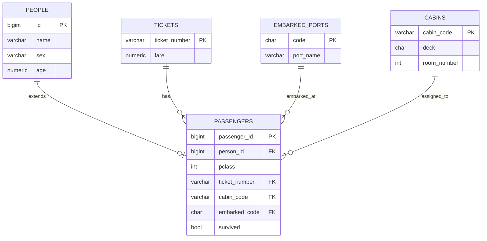

# Titanic ERD

타이타닉 생존 예측 도메인의 **정규화 ERD**이다.  
현재 프로젝트는 **프로젝트 내부 CSV 파일 읽기 코드를 사용하지 않는다.** 컬럼 설명은 `titanic/adapter/inbound/api/schemas/dataset_columns.py`와 `GET /titanic/schema`를 참고한다.  
본 문서는 DB·ORM을 분리 테이블로 설계할 때의 **목표 스키마**이다.

**상위 문서:** [BACKEND_RULES.md](./BACKEND_RULES.md) · [ENTITY_RULE.md](./ENTITY_RULE.md)

---

## ER 다이어그램

Mermaid `erDiagram`은 속성·관계 라벨의 **따옴표·괄호·슬래시** 등에서 파싱 오류가 납니다. 필드 설명은 아래 표를 참고하세요.

---

## 관계

| 관계 | 설명 |
|------|------|
| PEOPLE → PASSENGERS | 1:0..1, 상속/확장 (`person_id` → `PEOPLE.id`) |
| TICKETS → PASSENGERS | 1:N, 티켓 보유 |
| EMBARKED_PORTS → PASSENGERS | 1:N, 승선 항구 |
| CABINS → PASSENGERS | 1:N, 객실 배정 |

---

## 필드 설명

| 엔티티 | 필드 | 설명 |
|--------|------|------|
| PEOPLE | name | 이름 |
| PEOPLE | sex | 성별 |
| PEOPLE | age | 나이 |
| PASSENGERS | person_id | PEOPLE.id 참조 |
| PASSENGERS | pclass | 티켓 클래스 (1, 2, 3) |
| PASSENGERS | ticket_number | TICKETS.ticket_number |
| PASSENGERS | cabin_code | CABINS.cabin_code |
| PASSENGERS | embarked_code | EMBARKED_PORTS.code |
| PASSENGERS | survived | 생존 여부 (false=사망, true=생존) |
| TICKETS | fare | 운임 요금 |
| CABINS | deck | 구역 (A~G, T 등) |
| CABINS | room_number | 방 번호 |
| EMBARKED_PORTS | code | C, Q, S |
| EMBARKED_PORTS | port_name | Cherbourg, Queenstown, Southampton |

---

## 단일 CSV 컬럼과의 대응 (참고)

| CSV / 학습 컬럼 | ERD 엔티티·필드 |
|-----------------|-----------------|
| PassengerId | PASSENGERS.passenger_id |
| Name | PEOPLE.name |
| Sex | PEOPLE.sex |
| Age | PEOPLE.age |
| SibSp, Parch | (가족 관계 — 별도 테이블 확장 시) |
| Pclass | PASSENGERS.pclass |
| Ticket | PASSENGERS.ticket_number → TICKETS |
| Fare | TICKETS.fare |
| Cabin | PASSENGERS.cabin_code → CABINS |
| Embarked | PASSENGERS.embarked_code → EMBARKED_PORTS |
| Survived | PASSENGERS.survived |

현재 결정 트리 학습 피처: **Pclass, Sex, Age, Fare** (`adapter/inbound/api/schemas/dataset_columns.py`의 `ML_FEATURE_COLUMNS`).
